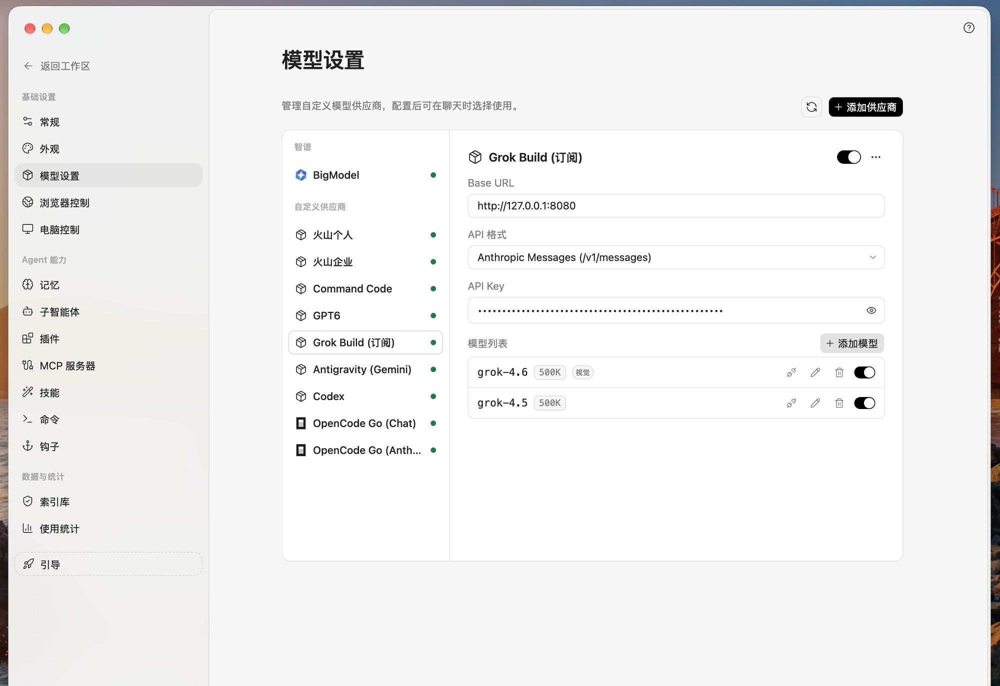
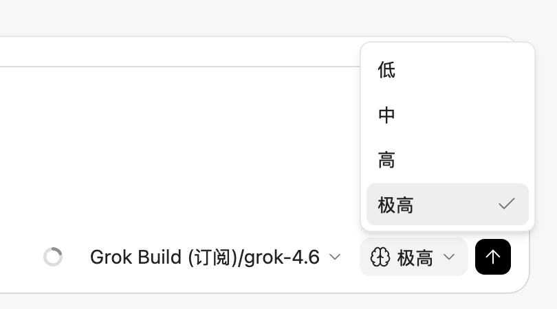
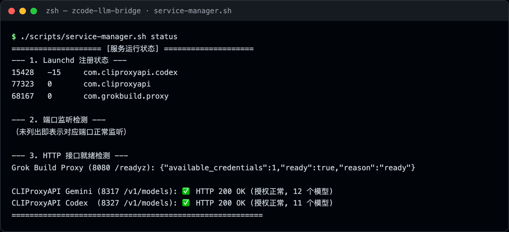
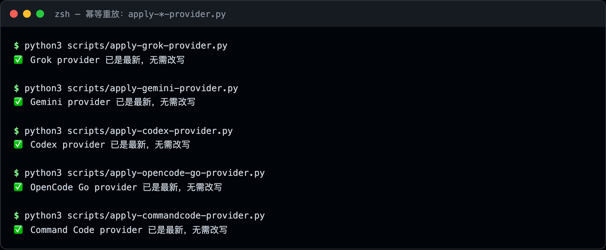
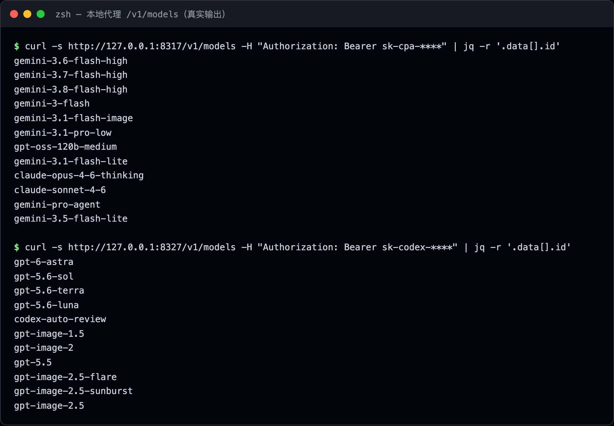

<div align="center">

# ZCode LLM Bridge

**把 Grok / Gemini / Codex / DeepSeek 订阅接入 [ZCode](https://z.ai)：
本地代理 · 真实思考档位 · macOS launchd / Windows 计划任务 配置自愈**

[](LICENSE)
[](https://github.com/renkaiyuan3-cpu/zcode-llm-bridge/actions/workflows/ci.yml)
[](https://github.com/renkaiyuan3-cpu/zcode-llm-bridge)
[](https://github.com/renkaiyuan3-cpu/zcode-llm-bridge)
[](CONTRIBUTING.md)

[简体中文](README.md) | [English](README.en.md)

</div>

---

> [!WARNING]
> **风险提示（请先阅读）**
>
> - 本项目为**非官方**社区项目，与 xAI、Google、OpenAI、ZCode（Z.ai）均无任何关联。
> - 所有接入均基于**你本人的合法订阅账号**。把订阅额度通过非官方通道转为 API 使用，
>   可能违反上游服务条款，存在**限流或封号风险**。同类项目（如 Antigravity 系代理）已有
>   用户报告被 Google 风控的案例。请自行评估，**风险自负**。
> - 所有 API Key / OAuth 凭据只存本机（`~/.cliproxyapi/`、`~/.grokbuild-proxy/` 等目录），
>   **永远不会**进入本仓库或任何网络传输（代理流量除外）。详见 [DISCLAIMER.md](DISCLAIMER.md)。

## 演示

ZCode 实机界面（2026-09-17）。模型设置里可以看到 Grok Build / Antigravity Gemini / Codex / Command Code / OpenCode Go；聊天输入栏的思考档位（低 / 中 / 高 / 极高）是真实注入的，不是摆设：

<p align="center">
  
</p>
<p align="center">
  
</p>

下面是同一台机器上的终端真实输出（密钥已打码）：

<p align="center">
  
</p>
<p align="center">
  
</p>
<p align="center">
  
</p>

## 为什么有这个项目

ZCode 的自定义供应商能力很强，但把「各家 CLI 订阅」接进去时会撞上四堵墙，本项目逐一给出了解法：

| 痛点 | 现象 | 本项目的解法 |
| :--- | :--- | :--- |
| **没有订阅通道** | ZCode 内置 Agent CLI 只支持 GLM（`enabledBuiltinAgentCliProviders = ["glm"]`），Grok/Gemini/Codex 订阅无处安放 | 本地代理桥接：CLIProxyAPI / grokbuild-proxy 把订阅 OAuth 转成标准 OpenAI / Anthropic 协议 |
| **UI 假档位** | 界面上配了 Low/Medium/High，抓包却发现请求里**根本没有** `thinking` 字段 | 逆向出 `reasoningSpec` 注入机制（见 [第 2 节](#2-核心技术突破zcode-思考模式reasoning深度逆向)），并处理「档位取值域不合法」的第二种变体 |
| **配置被回写剥掉** | ZCode 重启时悄悄删掉顶层 `reasoningSpec`，档位变回摆设 | `com.zcode.restore-reasoning` launchd 任务每 60 秒幂等补回（见 [第 4 节](#4-macos-launchd-常驻后台托管机制)） |
| **凭据互踢** | 订阅 OAuth 的 Refresh Token 单次轮换，多个客户端共用就互相踢下线 | 每个通道独立设备码授权 / 独立凭据目录，会话完全隔离 |

**5 条通道一览**（详细对照见[第 1 节](#1-整体架构与模型对照)）：

| 通道 | 接入方式 | 模型 | 思考档位 |
| :--- | :--- | :--- | :--- |
| **Grok Build** | 本地代理 `127.0.0.1:8080` | grok-4.7 / grok-4.6 / grok-4.5 | Anthropic `thinking`，4.7/4.6 支持 xhigh，4.7 支持图像输入 |
| **Antigravity Gemini** | 本地代理 `127.0.0.1:8317` | gemini-3.8/3.7-flash、gemini-pro-agent | Anthropic `thinking` |
| **Codex（ChatGPT 订阅）** | 本地代理 `127.0.0.1:8327` | gpt-6-astra、gpt-5.6-sol/terra/luna | `reasoning_effort`，5 档（超 272K 输入有计价陷阱⚠️） |
| **OpenCode Go** | 直连官方 API | deepseek-v4.1-flash | `reasoning_effort` |
| **Command Code** | 直连官方 API | deepseek-v4.1-flash、gpt-5.6-luna | `reasoning_effort`，**无 off 档**（选中即 400） |

## 快速开始

刚 clone 下来请先体检，它会告诉你缺 ZCode、缺 Key、还是缺代理二进制：

```bash
# macOS / Linux
python3 scripts/bridge.py doctor

# Windows（PowerShell）
py -3 scripts\bridge.py doctor
```

> 前置：[ZCode 客户端](https://z.ai)（macOS / Windows）+ Python 3.9+。
> ZCode **至少成功启动过一次**——注入脚本写的是 `~/.zcode/v2/config.json`（Windows 为 `%USERPROFILE%\.zcode\v2\config.json`），该文件由首次启动生成。
> Windows 逐步说明见 **[docs/windows-guide.md](docs/windows-guide.md)**。

```bash
git clone https://github.com/renkaiyuan3-cpu/zcode-llm-bridge.git
cd zcode-llm-bridge
```

### 方式 A：直连官方 API（最快，Mac / Windows 相同，无需本地代理）

```bash
# Command Code：把官方后台拿到的 Key 写入本机文件
mkdir -p ~/.commandcode && echo "sk-你的Key" > ~/.commandcode/api_key
python3 scripts/apply-commandcode-provider.py

# OpenCode Go 同理：~/.opencode-go/api_key + scripts/apply-opencode-go-provider.py
```

Windows 把 `python3` 换成 `py -3`，`mkdir -p ~/.commandcode` 换成 `New-Item -ItemType Directory -Force $env:USERPROFILE\.commandcode`。

### 方式 B：订阅 OAuth → 本地代理（Grok / Gemini / Codex）

> **开始前先看网络要求**：这三个通道分别要能访问 `cli-chat-proxy.grok.com`、
> `cloudcode-pa.googleapis.com`、`chatgpt.com`，受限网络（如大陆直连）需要给代理服务
> 单独配置 `proxy-url`（launchd 服务**不读**系统代理和终端环境变量）。详见
> **[docs/network-environment.md](docs/network-environment.md)**。

代理二进制不在本仓库。可手动从上游 Releases 下载，或一键拉取：

```bash
python3 scripts/bridge.py fetch          # 下载 CLIProxyAPI + grokbuild-proxy 到家目录
```

### 方式 B1：Gemini（Antigravity 订阅）

```bash
# 1. 安装 CLIProxyAPI：到 https://github.com/router-for-me/CLIProxyAPI/releases
#    下载 darwin 对应架构包，解压出的二进制放到位并赋权
mkdir -p ~/.cliproxyapi
cp ~/Downloads/cli-proxy-api-darwin-arm64 ~/.cliproxyapi/cli-proxy-api   # 按实际文件名调整
chmod +x ~/.cliproxyapi/cli-proxy-api
# 2. 示例配置
cp templates/cliproxyapi-gemini.example.yaml ~/.cliproxyapi/config.yaml
# 3. Google OAuth 登录（浏览器授权，凭据落在 ~/.cliproxyapi/auth/）
cd ~/.cliproxyapi && ./cli-proxy-api -config config.yaml -antigravity-login && cd -
# 4. 常驻 + 注入 ZCode
	python3 scripts/bridge.py install gemini    # macOS 也可用 ./launchd/install-launchd.sh gemini
	python3 scripts/apply-gemini-provider.py
```

**Codex（ChatGPT 订阅）** —— 复用同一个 CLIProxyAPI 二进制，独立实例（Windows 优先 `-codex-login`，见 Windows 指南）：

```bash
cp templates/cliproxyapi-codex.example.yaml ~/.cliproxyapi/config-codex.yaml
# 导入 ChatGPT 订阅凭据：先确保 Codex CLI / ChatGPT 桌面端登录过，
# 然后按 docs/codex-guide.md 第 4 节运行扁平化导入
	python3 scripts/bridge.py install codex
	python3 scripts/apply-codex-provider.py
```

**Grok Build** —— 独立设备码授权，与官方 Grok CLI 会话隔离（互不踢下线）：

```bash
# 1. 安装 grokbuild-proxy（获取方式见 docs/grokbuild-proxy-guide.md 第 1.1 节：
#    Releases 下载或 go build），目标位置 ~/.grokbuild-proxy/grokbuild-proxy
mkdir -p ~/.grokbuild-proxy
cp templates/grokbuild-proxy.example.yaml ~/.grokbuild-proxy/config.yaml
cd ~/.grokbuild-proxy && ./grokbuild-proxy -device-login && cd -
	python3 scripts/bridge.py install grok
	python3 scripts/apply-grok-provider.py
```

### 最后一步（必做）：安装思考档位自愈任务

```bash
python3 scripts/bridge.py install restore     # macOS launchd / Windows 计划任务 / Linux systemd
# macOS 旧入口：./launchd/install-launchd.sh restore
```

没有它，ZCode 重启时会把思考档位悄悄剥掉（见[第 4 节](#4-常驻后台macos-launchd--windows-计划任务)）。
然后**按下面的顺序重启 ZCode**（⚠️ 顺序错了会撞上竞态，模型选择器里就什么都看不到）：

```bash
# 1) 完全退出 ZCode（Cmd+Q / 菜单退出，不要只是关窗口）
# 2) 退出后再注入一遍（此时 ZCode 不会再用内存旧配置回写覆盖你）：
python3 scripts/apply-grok-provider.py        # 接了哪几个通道就跑哪几个
# 3) 确认配置里已经有你的供应商，再启动 ZCode：
python3 -c "import json,os;print(list(json.load(open(os.path.expanduser('~/.zcode/v2/config.json')))['provider']))"
```

> **为什么会这样**：ZCode 运行时把配置放在内存里，退出时会整体回写 `config.json`。
> 如果注入发生在 ZCode 运行期间，退出回写会把刚注入的供应商整个抹掉；
> 自愈任务最长 60 秒后补回，但若你在补回之前就启动了 ZCode，它读到的还是没有供应商的旧文件，
> 表现就是「明明 apply 成功了，模型选择器里却没有」——重试多少次都一样。
> 退出后再 apply，就完全绕开了这个窗口。巡检：

```bash
python3 scripts/bridge.py status              # 跨平台
./scripts/service-manager.sh status           # macOS 旧入口
```

### 验收：确认 ZCode 里真的接入成功（5 分钟）

逐条对照，全部通过即接入完成：

1. **代理侧健康**：`python3 scripts/bridge.py status`
   预期：8080 / 8317 / 8327 三个端口监听正常，两个 `/v1/models` 检测显示 `HTTP 200 OK` 且模型数 > 0
   （只接了部分通道的，对应端口正常即可）。
2. **ZCode 侧可见**：重启 ZCode 客户端，打开模型选择器。
   预期：出现 `Grok Build (订阅)`、`Antigravity (Gemini)`、`Codex`、`OpenCode Go`、`Command Code`
   等供应商分组（你接了哪几个就出现哪几个）。
3. **请求真实走通**：选一个新模型发一条消息（比如「用一句话介绍你自己」）。
   预期：正常回复；同时 `tail -f ~/.grokbuild-proxy/proxy.log`（或 `~/.cliproxyapi/server.log`）
   能看到这次请求打进了本地代理。
4. **思考档位真实生效**（本项目的核心卖点，别跳过）：切到 `High` 档发一道多步推理题，
   再切 `Low` 档发同一道题。
   预期：High 档响应前有可感知的更长等待，代理日志里 reasoning tokens 明显更大
   （对照数据见 [docs/commandcode-guide.md](docs/commandcode-guide.md) 第 3.2 节）。
   如果两档毫无差别 → 八成是 `reasoningSpec` 被 ZCode 回写剥掉了，看第 5 条。
5. **自愈任务在岗**：
   ```bash
   python3 scripts/bridge.py doctor                                   # 跨平台，看 Restore 那一行
   launchctl list com.zcode.restore-reasoning | grep LastExitStatus   # macOS，应为 0
   tail -5 ~/.zcode/v2/logs/restore-reasoning.err.log                 # 应为空
   ```
   macOS 报 `Operation not permitted` → 脚本落在了受 TCC 保护的目录，重跑 `python3 scripts/bridge.py install restore`（详见第 6.6 节）。
   Windows 看任务计划程序里的 `ZCodeLLMBridge.RestoreReasoning`。

任何一步不符，直接去[第 6 节故障排除速查手册](#6-日常运维与故障排除速查手册)对号入座。

---

## 目录索引

- [1. 整体架构与模型对照](#1-整体架构与模型对照)
- [2. 核心技术突破：ZCode 思考模式（Reasoning）深度逆向](#2-核心技术突破zcode-思考模式reasoning深度逆向)
- [3. 接入实现细节](#3-接入实现细节)
  - [3.1 Grok Build Proxy 接入方案](#31-grok-build-proxy-接入方案)
  - [3.2 Antigravity Gemini CLIProxyAPI 接入方案](#32-antigravity-gemini-cliproxyapi-接入方案)
  - [3.3 OpenCode Go（DeepSeek V4.1 Flash）](#33-opencode-godeepseek-v41-flash)
  - [3.4 Command Code（DeepSeek V4.1 Flash + GPT-5.6 Luna）](#34-command-codedeepseek-v41-flash--gpt-56-luna)
  - [3.5 Codex（ChatGPT 订阅：GPT-6 / GPT-5.6）](#35-codexchatgpt-订阅gpt-6--gpt-56)
- [4. 常驻后台：macOS launchd / Windows 计划任务](#4-常驻后台macos-launchd--windows-计划任务)
- [5. 项目目录与工具链使用说明](#5-项目目录与工具链使用说明)
- [6. 日常运维与故障排除速查手册](#6-日常运维与故障排除速查手册)
- [Windows 指南](docs/windows-guide.md) · [网络环境要求](docs/network-environment.md) · [还能接什么](docs/roadmap.md)
- [致谢](#致谢) · [License 与免责](#license-与免责)

---

## 1. 整体架构与模型对照

Grok、Gemini、Codex 走本地回环代理，OpenCode Go 与 Command Code 直连官方 API。思考档位由 `~/.zcode/v2/config.json` 注入；macOS 用 `launchd`、Windows 用计划任务、Linux 用 systemd --user，负责代理常驻和档位补丁自愈。

```
┌───────────────────────────────────────────────────────────────────────────────────┐
│                                    ZCode 客户端                                    │
│                         全局配置: ~/.zcode/v2/config.json                          │
└───┬──────────────────┬──────────────────┬──────────────────┬───────────┬───────────┘
    │ 127.0.0.1:8080   │ 127.0.0.1:8317   │ 127.0.0.1:8327   │ HTTPS     │ HTTPS
    ▼                  ▼                  ▼                  ▼           ▼
┌─────────────┐ ┌─────────────┐ ┌─────────────┐ ┌────────────┐ ┌─────────────┐
│Grok Build   │ │CLIProxyAPI  │ │CLIProxyAPI  │ │OpenCode Go │ │Command Code │
│Proxy        │ │(Gemini)     │ │(Codex)      │ │opencode-go │ │commandcode- │
│com.grokbuild│ │com.cliproxy │ │com.cliproxy │ │            │ │local        │
│.proxy       │ │api          │ │api.codex    │ │            │ │             │
└──────┬──────┘ └──────┬──────┘ └──────┬──────┘ └─────┬──────┘ └──────┬──────┘
       ▼               ▼               ▼              ▼               ▼
 cli-chat-proxy   cloudcode-pa.   chatgpt.com/    opencode.ai/   api.command
 .grok.com        googleapis      backend-api/    zen/go/v1      code.ai/
                                  codex                          provider/v1
```

### 服务对照表

| 特性 | Grok Build | Antigravity Gemini | Codex | OpenCode Go | Command Code |
| :--- | :--- | :--- | :--- | :--- | :--- |
| **供应商 ID** | `grokbuild-local` | `antigravity-gemini` | `codex-local` | `opencode-go` | `commandcode-local` |
| **接入方式** | 本地代理 `127.0.0.1:8080` | 本地代理 `127.0.0.1:8317` | 本地代理 `127.0.0.1:8327` | 直连官方 API | 直连官方 API |
| **协议** | Anthropic Messages | Anthropic Messages | OpenAI Compatible | OpenAI Compatible | OpenAI Compatible |
| **模型** | `grok-4.7`, `grok-4.6`, `grok-4.5` | `gemini-3.8-flash-high`, `gemini-3.7-flash-high`, `gemini-pro-agent` | `gpt-6-astra`, `gpt-5.6-sol`, `gpt-5.6-terra`, `gpt-5.6-luna` | `deepseek-v4.1-flash` | `deepseek/deepseek-v4.1-flash`, `gpt-5.6-luna` |
| **上下文窗口** | 500,000 | 1,048,576 | 1,000,000（Codex 默认 272K，可开 1M） | 1,000,000 | 1,000,000 / 1,050,000 |
| **思考档位** | 4.7 / 4.6：low/medium/high/xhigh；4.5：low/medium/high | low/medium/high | low/medium/high/xhigh/max（默认 High） | High（`reasoning_effort`） | High（`reasoning_effort`，档位无 `off`） |
| **速度档** | — | — | ⚠️ 上游按账号忽略，未接入 | — | — |

---

## 2. 核心技术突破：ZCode 思考模式（Reasoning）深度逆向

### 2.1 UI「假档位」陷阱
在接入自定义 Anthropic 兼容模型时，很多人按照前端规范在模型定义中写了：
```json
"reasoning": {
  "variants": ["low", "medium", "high"],
  "defaultVariant": "high"
}
```
**问题现象**：ZCode 界面上虽然出现了 Low / Medium / High 下拉选项，但抓包查看发给代理服务的 HTTP POST Body 时，**发现根本没有任何思考相关字段（`thinking`）**！模型只能以非思考模式或最低默认档位运行。

### 2.2 逆向源码与解决方案
通过对 ZCode 宿主源码（`out/host/index.js`）深入逆向：
1. **真实参数注入者**：ZCode 内部在拼装 Anthropic 协议请求时，检查的是模型配置中的 **`reasoningSpec`**。
2. **JSON 路径操作**：通过 `levels.<档位>.anthropic.set`，对请求体注入目标字段：
   ```json
   "reasoningSpec": {
     "defaultLevel": "high",
     "levels": {
       "high": {
         "anthropic": {
           "set": [{
             "path": ["thinking"],
             "value": { "type": "enabled", "budgetTokens": 60000 }
           }]
         }
       }
     }
   }
   ```
3. **驼峰转下划线**：ZCode 将 `budgetTokens` 自动序列化为 Wire 协议标准的 `thinking.budget_tokens: 60000`。
4. **规避上游校验限制**：Anthropic 协议规范要求 `budget_tokens < max_tokens`。ZCode 会在注入 `thinking` 后，自动将请求体中的 `max_tokens` 修正为：
   $$\text{max\_tokens} = \text{budget\_tokens} + 1$$
   彻底解决了手动配置容易引发的 `HTTP 400 (budget exceeds max_tokens)` 报错。

### 2.3 效果对比
- **Low 档位（4096 tokens）**：实测模型输出思维链 token 约 600+，响应迅速。
- **High 档位（60000 tokens）**：实测模型输出思维链 token 达 2500 ~ 15000+，完整展示深度推理过程，代码质量和复杂架构设计能力大幅提升。

### 2.4 假档位的第二种变体：取值域不合法

「假档位」不只是「注入了没有」，还有一种更隐蔽的形态：**档位注入了，但取值不在上游合法域内**。
界面上档位选项照常显示，用户一点就必然报错。

Command Code 就是实例——上游只接受 `low|medium|high|xhigh|max`：

```
HTTP 400 Invalid option: expected one of "low"|"medium"|"high"|"xhigh"|"max"
```

而共享库的 `openai_reasoning_spec()` 会把 `off` 映射成 `none`。所以只要档位列表里写了 `off`，
这个选项就是一条必挂的请求。**接入新供应商时，档位列表必须逐个对着上游取值域核一遍，不能照抄别家的。**

*(详细逆向调用链与代码剖析见 [docs/reasoning-spec-analysis.md](docs/reasoning-spec-analysis.md))*

### 2.5 假档位的第三种变体：双配置文件 + 双 schema（ZCode 3.14+）

**问题现象**：新加的模型（如 grok-4.7、Gemini 系）思考控制只有「开/关」两态，没有档位下拉；
而老模型（grok-4.6）明明配置长得一模一样却有完整档位。

**根因**：ZCode 3.14 起编辑器的档位列表来自模型注册表（CLI 守护进程 `zcode.cjs`），和旧版只读 config.json 的链路完全不同，一共要同时喂四份地方：

| 位置 | 文件 | 字段 | 谁在读 |
| :--- | :--- | :--- | :--- |
| UI 档位标记（旧） | `~/.zcode/v2/config.json` → `provider.<id>.models.<mid>.reasoning` | `variants` / `defaultVariant` | App 端（旧 opencode schema） |
| UI 档位标记（新） | 同上 | `levels` / `defaultLevel` | CLI 端 `zcode.cjs`（xqa schema，不认 `variants`） |
| 真实参数注入 | 同上 | `reasoningSpec` / `zcode.reasoning` | 请求拼装（见 2.2） |
| 注册表档位 | `~/.zcode/v2/provider_config.json` → `config.modelConfigRules.providerModelRules[]` | `config.optionSpecs.reasoningLevel.values` | CLI 模型注册表 → `list_models` → 编辑器下拉 |

只写 `variants` 不写 `levels`，CLI 解析出来的模型就没有档位（`thoughtLevel.available` 为空），
UI 退化成思考开关。两个 schema 都不是 strict，混写安全。

**解法**（已进 `lib_zcode_providers.py`）：
- `ui_reasoning()` 同时输出 `variants` + `levels` 两套键；
- 新增 `ensure_option_specs()` 把 `optionSpecs.reasoningLevel.values` 写进 provider_config.json；
- 新增 `resolve_picker_provider_id()`：早期手动加的供应商在选择器里是 UUID 形态条目
  （如 Command Code 的 `1c1e8e24-...`），写 optionSpecs 必须先按 `providerName` 解析出真实 ID。

**改完配置必须「退出 ZCode → 跑 apply 脚本 → 再启动」**：CLI 守护进程只在启动时读盘，
热改文件它内存里还是旧的；而且 ZCode 退出时会用内存态回写 config.json，先改会被冲掉。
自愈任务（第 4 节）每 60 秒补一次，覆盖「忘记先退出」的场景。

**默认档位约定**：注册表的默认档位取 `values` 数组**最后一项**（CLI 源码 `defaultLevel: s.values.at(-1)`）。
所以 grok-4.7 新选中时默认 xhigh、Codex 默认 max——都是合法档位，介意的话在下拉里选一次即可（按工作区记忆）。

*(详细逆向调用链与代码剖析见 [docs/reasoning-spec-analysis.md](docs/reasoning-spec-analysis.md))*

---

## 3. 接入实现细节

### 3.1 Grok Build Proxy 接入方案
- **痛点**：官方 Grok CLI（`~/.grok`）的 Refresh Token 具有单次轮换机制。若直接共享 Token，会导致终端 CLI 与 ZCode 互相踢下线。
- **解法**：在 `~/.grokbuild-proxy` 中独立运行设备码授权流程（Device Code Flow），生成独立的会话数据 `data/meta.json`。
- **ZCode 注入**：执行 `scripts/apply-grok-provider.py`，自动抓取 `meta.json` 中的 `api_key` 并注册 Provider `grokbuild-local`。
- 详见：[docs/grokbuild-proxy-guide.md](docs/grokbuild-proxy-guide.md)

### 3.2 Antigravity Gemini CLIProxyAPI 接入方案
- **技术栈**：利用成熟的 `CLIProxyAPI` 作为本地网关，代理 Google Antigravity 的 OAuth 登录。
- **模型优化**：
  - 剔除了固定锁死在 Low 思考档位的 `gemini-3.1-pro-low`。
  - 将官方最强旗舰模型 `gemini-pro-agent` 显示名命名为 `Gemini 3.1 Pro`。
  - 当前只保留 3 个模型：`gemini-3.8-flash-high`、`gemini-3.7-flash-high`、`gemini-pro-agent`（显示名 Gemini 3.1 Pro）。
  - 统一配置真实生效的 High 档默认思考。
- **ZCode 注入**：执行 `scripts/apply-gemini-provider.py`，自动抓取 `~/.cliproxyapi/.keys` 中的 Bearer Token 并更新全局配置。
- 详见：[docs/cliproxyapi-gemini-guide.md](docs/cliproxyapi-gemini-guide.md)

### 3.3 OpenCode Go（DeepSeek V4.1 Flash）
- **不走本地代理**，直连 `https://opencode.ai/zen/go/v1`。
- 只暴露一个模型：`deepseek-v4.1-flash`。
- 协议是 OpenAI Compatible，思考档位注入的是 `reasoning_effort`，不是 Anthropic `thinking`。
- API Key 存在本机 `~/.opencode-go/api_key`，不进仓库。
- **ZCode 注入**：执行 `scripts/apply-opencode-go-provider.py`。
- 详见：[docs/opencode-go-guide.md](docs/opencode-go-guide.md)

### 3.4 Command Code（DeepSeek V4.1 Flash + GPT-5.6 Luna）
- **不走本地代理**，直连 `https://api.commandcode.ai/provider/v1`。
- 订阅里实际有 69 个模型，只暴露 `deepseek/deepseek-v4.1-flash` 与 `gpt-5.6-luna`，其余全部 tombstone。
- 协议 OpenAI Compatible，思考档位注入 `reasoning_effort`。
- **上游取值域是 `low/medium/high/xhigh/max`，没有 `off`**。传 `none` 直接 HTTP 400，所以档位必须剔除 `off`（`openai_reasoning_spec()` 恰会把它映射成 `none`）。
- **不支持 PDF 输入**，只支持 text + image（实测 `file` 内容类型返回 400）；输出上限 DeepSeek 为 393216，Luna 更高。
- API Key 存在本机 `~/.commandcode/api_key`，不进仓库。
- **ZCode 注入**：执行 `scripts/apply-commandcode-provider.py`。
- 详见：[docs/commandcode-guide.md](docs/commandcode-guide.md)。

### 3.5 Codex（ChatGPT 订阅：GPT-6 / GPT-5.6）
- **终端版位置**：Codex 没有独立 CLI，捆绑在 `/Applications/ChatGPT.app/Contents/Resources/codex`（不在 PATH，可直接全路径调用）。
- **接入方式**：复用已在跑的 CLIProxyAPI，但**另起一个实例**（`config-codex.yaml` @ `127.0.0.1:8327`），凭据目录独立为 `auth-codex/`，避免和 Gemini 的模型列表互相污染。
- **关键坑：凭据格式**。CPA 的账号文件是扁平结构且必须带 `type: "codex"`；把 `~/.codex/auth.json` 原样复制过去会**静默失败**（日志显示 `1 auth entries` 但 `0 个模型`）。
- **关键坑：档位取值域**。模型目录里标了 6 档（含 `ultra`），但 CPA **实测拒收 `ultra`**，合法值只有 `low/medium/high/xhigh/max`。模型目录写了不等于上游接受。
- **速度档接不进来**：`service_tier: priority/ultrafast` 被后端按账号忽略——绕过 CPA 直连 `chatgpt.com/backend-api/codex/responses` 实测，回显恒为 `default`。属 Plus 订阅的账号级限制，故不暴露（避免造假档位）。
- **上下文可开 1M**：目录里 `context_window = 272000` 只是 Codex 的默认档；官方文档标注 GPT-5.6 全系支持 **1,050,000**，目录里另有 `max_context_window = 872000`（恰好 = 1000000 − 128000 输出预留）。本供应商统一写 `context = 1000000`，实测 397,606 token 输入 HTTP 200 通过。⚠️ **但单次输入超 272K 会触发 2x/1.5x 计价倍率（乘整个请求），显著加快额度消耗。**
- 只暴露 4 个模型：`gpt-6-astra`、`gpt-5.6-sol`、`gpt-5.6-terra`、`gpt-5.6-luna`；其余 7 个（`gpt-5.5`、`codex-auto-review`、6 个 `gpt-image-*`）全部 tombstone。
- **ZCode 注入**：执行 `scripts/apply-codex-provider.py`。
- 详见：[docs/codex-guide.md](docs/codex-guide.md)。

---

## 4. 常驻后台：macOS launchd / Windows 计划任务

为了让代理服务像系统原生服务一样后台无感运行，macOS 在 `~/Library/LaunchAgents/` 下注册 launchd；Windows 注册任务计划程序（任务名 `ZCodeLLMBridge.*`，详见 [docs/windows-guide.md](docs/windows-guide.md)）。统一入口：

```bash
python3 scripts/bridge.py install restore|grok|gemini|codex|all
python3 scripts/bridge.py status
```

macOS 仍可用原来的 plist：

1. **`com.grokbuild.proxy.plist`**：托管 `grokbuild-proxy -config config.yaml`。
2. **`com.cliproxyapi.plist`**：托管 `cli-proxy-api -config config.yaml`（Antigravity Gemini，8317）。
3. **`com.cliproxyapi.codex.plist`**：托管 `cli-proxy-api -config config-codex.yaml`（Codex，8327）。
4. **`com.zcode.restore-reasoning.plist`**：每 60 秒检查并补回自定义供应商的思考补丁。ZCode 重启回写配置时会剥掉顶层 `reasoningSpec`，没有这个任务，界面档位会变成摆设。

### 核心特性：
- `RunAtLoad = true`：开机/用户登录即自动拉起。
- `KeepAlive = true`：异常崩溃或进程被 Kill 后系统自动秒级拉起。
- `StandardOutPath` / `StandardErrorPath`：日志重定向至各代理目录下的日志文件中，便于实时跟踪排查。

*(plist 模板位于 `launchd/`，macOS 也可用 `./launchd/install-launchd.sh {grok|gemini|codex|restore|all}`。Windows 不要拷这些 plist，用 `bridge.py install`。)*

### ⚠️ 坑：launchd 读不到桌面目录（TCC）

自愈任务最初直接指向仓库里的 `scripts/restore-reasoning.py`（仓库放在 `~/Desktop` 下），结果**每分钟都静默失败**：

```
python3: can't open file '.../Desktop/zcode-llm-bridge/scripts/restore-reasoning.py':
[Errno 1] Operation not permitted
```

`Operation not permitted` 是 macOS TCC 拦截——`~/Desktop`、`~/Documents`、`~/Downloads` 属于受保护目录，
launchd 后台进程没有权限读取，而手动在终端跑同一个脚本却完全正常，很容易误判成脚本 bug。

**后果**：任务退出码一直是 2，`reasoningSpec` 从来没被补回去，所有供应商的档位其实一直是空壳。

**解法**：脚本运行时副本放家目录，绕开 TCC。安装命令：

```bash
python3 scripts/bridge.py install restore
```

它会把 `scripts/*.py` 同步到 `~/.zcode-proxy/`，并安装对应平台的自愈任务（macOS 重写 launchd plist，Windows 注册计划任务）。
**每次改动 `scripts/` 下的脚本后，都要重跑一次 install restore**，否则运行时副本不会更新。

排查该任务是否健康：
```bash
launchctl list com.zcode.restore-reasoning | grep LastExitStatus   # 应为 0
tail -5 ~/.zcode/v2/logs/restore-reasoning.err.log                 # 应为空/无新增
```

---

## 5. 项目目录与工具链使用说明

```
	zcode-llm-bridge/
	├── README.md                          # 本经验总览指南（中文）
	├── README.en.md                       # English version
	├── DISCLAIMER.md                      # 风险与免责声明（先读）
	├── CONTRIBUTING.md                    # 如何新增一个供应商
	├── CODE_OF_CONDUCT.md
	├── SECURITY.md
	├── docs/                              # 深度技术文档
	│   ├── windows-guide.md               # Windows 计划任务 / 路径 / 验收
	│   ├── roadmap.md                     # 还能接什么
	│   ├── reasoning-spec-analysis.md
	│   ├── grokbuild-proxy-guide.md
	│   ├── cliproxyapi-gemini-guide.md
	│   ├── opencode-go-guide.md
	│   ├── commandcode-guide.md
	│   └── codex-guide.md
	├── scripts/
	│   ├── bridge.py                      # 跨平台入口：doctor / fetch / install / status
	│   ├── apply-*-provider.py            # 幂等注入各供应商
	│   ├── import-codex-auth.py           # 扁平化导入 ~/.codex/auth.json
	│   ├── restore-reasoning.py           # 自愈：补回被剥掉的思考补丁
	│   ├── install-runtime.sh             # macOS 旧入口
	│   ├── service-manager.sh             # macOS 旧入口
	│   └── lib_zcode_providers.py
	├── windows/                           # PowerShell 包装（调用 bridge.py）
	│   ├── install-runtime.ps1
	│   ├── service-manager.ps1
	│   └── fetch-binaries.ps1
	├── launchd/                           # macOS launchd plist 模板与安装器
	│   ├── com.cliproxyapi.plist
	│   ├── com.cliproxyapi.codex.plist
	│   ├── com.grokbuild.proxy.plist
	│   ├── com.zcode.restore-reasoning.plist
	│   └── install-launchd.sh
	└── templates/                         # 纯净配置模板（无任何真实凭据）
    ├── zcode-provider-snippet.json    # ZCode 供应商配置结构示例
    ├── cliproxyapi-gemini.example.yaml
    ├── cliproxyapi-codex.example.yaml
    └── grokbuild-proxy.example.yaml
```

运行时副本（由 `install-runtime.sh` 生成，不受 Git 管理）：`~/.zcode-proxy/`。
密钥本机存放位置：`~/.grokbuild-proxy/`、`~/.cliproxyapi/.keys`（Gemini）、`~/.cliproxyapi/.keys-codex`（Codex）、`~/.opencode-go/api_key`、`~/.commandcode/api_key`。**全部不进 Git。**

---

## 6. 日常运维与故障排除速查手册

### 6.1 服务状态一键巡检
使用本项目提供的脚本：
```bash
python3 scripts/bridge.py status
./scripts/service-manager.sh status    # macOS 旧入口
```
该命令会自动检查：
1. 调度器（launchd / 计划任务）中服务是否在册。
2. `8080`、`8317`、`8327` 三个端口的本地监听状态。
3. `http://127.0.0.1:8080/readyz` 健康检测。
4. `http://127.0.0.1:8317/v1/models` 与 `http://127.0.0.1:8327/v1/models` 带鉴权检测（含模型数量）。

### 6.2 一键重启服务
```bash
# 重启全部服务
python3 scripts/bridge.py restart all
./scripts/service-manager.sh restart     # macOS 旧入口

# 单独重启 Grok
./scripts/service-manager.sh restart-grok

# 单独重启 Gemini
./scripts/service-manager.sh restart-gemini

# 单独重启 Codex
./scripts/service-manager.sh restart-codex
```

### 6.3 更新与升级：哪些操作会破坏配置、怎么恢复

**会破坏注入的操作只有两类**：

1. **ZCode 客户端升级/重置**——升级或重置会重写 `~/.zcode/v2/config.json`，注入的档位字段可能被剥掉；
   大版本升级还可能改 CLI schema（本项目 3.14 就因此踩过「双 schema」坑，见 2.5 节），届时需关注本仓库更新。
2. **上游代理服务重装/换凭据**——Key 变了就要重跑对应 apply 脚本同步。

**恢复流程（对两类都适用）**：
```bash
python3 scripts/apply-grok-provider.py
python3 scripts/apply-gemini-provider.py
python3 scripts/apply-opencode-go-provider.py
python3 scripts/apply-commandcode-provider.py
python3 scripts/apply-codex-provider.py
```
执行顺序有讲究：**先完全退出 ZCode，再跑上面的脚本，最后启动 ZCode**。
在 ZCode 运行期间跑这些脚本，退出时的内存回写会把注入结果抹掉，
自愈任务虽然会在 60 秒内补回，但你若抢在补回之前启动 ZCode，选择器里就看不到新供应商——
这正是「apply 明明成功、界面却没有模型」的原因（详见[快速开始](#快速开始)末尾的说明）。

**本仓库自身更新（`git pull`）后**，还要把新脚本同步到运行时目录，否则自愈任务跑的还是旧逻辑：
```bash
python3 scripts/install-runtime.sh   # 重装 ~/.zcode-proxy/ 副本
```
（若脚本无变化，这步可跳过；拿不准就跑一次，幂等。）

**升级 ZCode 前建议**：先看本仓库 Release / README 是否有兼容性说明，再升级；升级后跑一遍上面的恢复流程
+ [6.1 巡检](#61-服务状态一键巡检)即可。日常使用中自愈任务会兜底，不必过分紧张。

### 6.4 账号 Token 过期重新授权
- **Grok Build 失效**：
  ```bash
  cd ~/.grokbuild-proxy && ./grokbuild-proxy -device-login
  launchctl kickstart -k gui/$(id -u)/com.grokbuild.proxy
  python3 scripts/apply-grok-provider.py
  ```
- **Gemini 失效**：
  ```bash
  cd ~/.cliproxyapi && ./cli-proxy-api -config config.yaml -antigravity-login
  launchctl kickstart -k gui/$(id -u)/com.cliproxyapi
  python3 scripts/apply-gemini-provider.py
  ```
- **Command Code / OpenCode Go 失效**：直连 API，没有 OAuth 流程，换 Key 后重跑对应脚本即可：
  ```bash
  python3 scripts/apply-commandcode-provider.py
  ```
- **Codex 失效**：与 Codex CLI／桌面端共用同一份 refresh_token，谁先刷新都可能让对方失效。重跑导入（详见 [docs/codex-guide.md](docs/codex-guide.md) 第 4 节）：
  ```bash
  ~/.codex/auth.json  →  重新扁平化导入  →  ~/.cliproxyapi/auth-codex/
  launchctl kickstart -k gui/$(id -u)/com.cliproxyapi.codex
  ```
  根治办法是让 CPA 走自己的 `-codex-login` 拿独立凭据，之后互不干扰。

### 6.5 界面档位点了报 400
先确认该档位是否在上游合法域内。Command Code 不接受 `off`（映射为 `none`），只接受 `low/medium/high/xhigh/max`。
Codex 的模型目录里写了 `ultra`，但 CPA 实测拒收，合法值只有 `low/medium/high/xhigh/max`。
核对脚本里的档位表与上游实际取值域是否一致。详见 [docs/commandcode-guide.md](docs/commandcode-guide.md) 第 3 节、[docs/codex-guide.md](docs/codex-guide.md) 第 5 节。

### 6.6 自愈任务排查
`launchctl list` 里看到退出码非 0、或配置里的 `reasoningSpec` 集体消失，先看：
```bash
tail -20 ~/.zcode/v2/logs/restore-reasoning.err.log
```
若报 `Operation not permitted`，说明脚本路径又落回了受 TCC 保护的目录（桌面/文稿/下载）。
执行 `python3 scripts/bridge.py install restore` 把运行时副本装到 `~/.zcode-proxy/` 即可。
注意：新写的 `apply-*.py` 必须重跑一次 install restore，否则自愈任务读不到它。

### 6.7 Codex 模型列表为空（最隐蔽的坑）

现象：CPA 日志显示 `1 auth entries`，但 `/v1/models` 返回 **0 个模型**，且**不报任何错**。

原因：`auth-codex/` 里的账号文件格式不对。CPA 要的是**扁平结构 + `type: "codex"`**；直接把 `~/.codex/auth.json`（`{"auth_mode", "tokens": {...}}` 嵌套结构）复制过去就会被静默忽略。

```bash
# 诊断：确认账号文件是扁平结构且带 type
	python3 scripts/import-codex-auth.py --help
	python3 -c "
	import json,glob,os
	for f in glob.glob(os.path.expanduser('~/.cliproxyapi/auth-codex/*.json')):
	    d=json.load(open(f)); print(os.path.basename(f), '| type =', d.get('type'), '| 扁平 =', 'access_token' in d)
	"
# 期望输出：type = codex | 扁平 = True
```

修复：按 [docs/codex-guide.md](docs/codex-guide.md) 第 4 节重新导入。

### 6.8 端口占用速查
| 端口 | 服务 | 配置 | 凭据 | API Key |
| :--- | :--- | :--- | :--- | :--- |
| 8080 | Grok Build Proxy | `~/.grokbuild-proxy/config.yaml` | `~/.grokbuild-proxy/data/` | 写入 ZCode 配置 |
| 8317 | CLIProxyAPI（Gemini） | `~/.cliproxyapi/config.yaml` | `~/.cliproxyapi/auth/` | `~/.cliproxyapi/.keys` |
| 8327 | CLIProxyAPI（Codex） | `~/.cliproxyapi/config-codex.yaml` | `~/.cliproxyapi/auth-codex/` | `~/.cliproxyapi/.keys-codex` |

### 6.9 网络环境要求（Gemini / Grok / Codex 需要能到外网）

三个订阅通道的上游分别是 `cloudcode-pa.googleapis.com`（Gemini）、`chatgpt.com`（Codex）、`cli-chat-proxy.grok.com`（Grok），在受限网络下需要代理。**最容易踩的坑**：这三个代理服务由 launchd 托管，**不读你终端里的 `HTTP_PROXY`，也不读 macOS 系统代理设置**——开了 Clash 系统代理但 Gemini 仍然超时，基本就是这个原因。代理必须写进各服务自己的配置（`proxy-url` / `proxy.mode`）。

每个域名的连通性自测命令、三种网络形态的判断方法、每个服务的代理配置段落，全部整理在 **[docs/network-environment.md](docs/network-environment.md)**。

### 6.10 Grok 全通道 503：凭据冷却陷阱（别急着重新登录）

**症状**：Grok 之前一直正常，突然所有请求 503，报 `no usable upstream credentials`；`/v1/models` 却还能返回。

**根因**：grokbuild-proxy 是单凭据、无 failover 的设计。**在途请求被掐断**（重启 ZCode、手滑停止生成、网络抖动）会被记成一次凭据失败，连续失败触发凭据冷却，冷却期内整条通道 503。实测冷却约 **5 分钟**，之后自愈。

**处置**：
1. **等 5 分钟再试**，不要立刻重新 device-login（重新登录无法加速冷却，反而可能把好凭据换掉）。
2. 期间可用日志确认是冷却而不是 token 真过期：
   ```bash
   grep -E 'context canceled|credential' ~/.grokbuild-proxy/proxy.log | tail -5
   ```
   看到 `context canceled` → 就是冷却，等。
3. 5 分钟后仍 503、且日志里有 `401` → 才走 6.4 的重新授权流程。

### 6.11 新模型只有「思考开关」、没有档位下拉

**症状**：新接入的模型（本项目曾发生在 grok-4.7 与 Gemini 全系）思考控制只显示开/关两态，没有 low/medium/high 下拉；而配置文件里明明写全了。

**根因**：ZCode 3.14 起档位下拉的数据来自 CLI 模型注册表，它读的是 `reasoning.levels`（新 schema）和 provider_config.json 的 `optionSpecs`，不认旧版 `variants`。机制详见 [2.5 节](#25-假档位的第三种变体双配置文件--双-schema-zcode-314)。

**修复**（本项目脚本已内置双写，一般更新脚本即可）：
```bash
git pull
python3 scripts/install-runtime.sh        # 同步到 ~/.zcode-proxy/
# 完全退出 ZCode，然后：
python3 ~/.zcode-proxy/restore-reasoning.py
# 再启动 ZCode
```
**验证**：模型选择器里选中该模型，思考控制应出现档位下拉（而非开关）。

### 6.12 上游出了新模型（如 grok-4.8）怎么接

以 grok 为例，三步：
1. 编辑 `scripts/apply-grok-provider.py` 的 `specs` 字典，加一行 `"grok-4.8": ("Grok 4.8", True)`（第二个布尔值 = 是否带 xhigh 档）。档位取值域必须先对上游核实（见 2.4 节的教训）。
2. 重新注入：完全退出 ZCode → `python3 scripts/apply-grok-provider.py` → 启动 ZCode（顺序原因见 6.3）。
3. 若希望出现在选择器里，还需把模型 ID 加进 `~/.zcode/v2/provider_config.json` 对应供应商的 `personalModelIds` 与 `modelOrder`（选择器白名单，不写不显示）。

Gemini / Codex / Command Code 同理，各改各的 apply 脚本模型表。

---

## 致谢

本仓库的实现站在这些优秀项目的肩膀上：

- [router-for-me/CLIProxyAPI](https://github.com/router-for-me/CLIProxyAPI) —— Gemini / Codex 订阅桥接的核心网关
- [GreyGunG/grokbuild-proxy](https://github.com/GreyGunG/grokbuild-proxy) —— Grok Build 订阅的本地 Anthropic 协议代理
- [musistudio/claude-code-router](https://github.com/musistudio/claude-code-router)、[badrisnarayanan/antigravity-claude-proxy](https://github.com/badrisnarayanan/antigravity-claude-proxy)、[ericc-ch/copilot-api](https://github.com/ericc-ch/copilot-api) —— 同类思路的优秀参考

也感谢 ZCode 提供的可扩展自定义供应商配置面。

## License 与免责

代码以 [MIT License](LICENSE) 开源。**MIT 仅覆盖仓库内的代码与文档，不覆盖你的使用方式** ——
订阅额度转 API 的合规风险由使用者自行承担。详见 [DISCLAIMER.md](DISCLAIMER.md)。

参与讨论请遵守 [CODE_OF_CONDUCT.md](CODE_OF_CONDUCT.md)；安全漏洞请按 [SECURITY.md](SECURITY.md) 私下报告。下一步想接哪些通道见 [docs/roadmap.md](docs/roadmap.md)。

<div align="center">

[](https://star-history.com/#renkaiyuan3-cpu/zcode-llm-bridge&Date)

</div>
